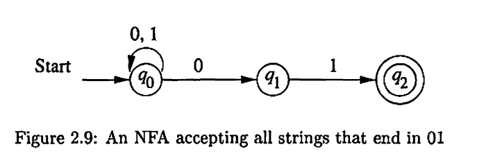

- In this Chapter, we will formally define **finite automata**, including deterministic automata and nondeterministic automata.
	- The distinction is whether the control of the finite machine is deterministic, i.e., the automata cannot be in more than one state any one time.
- We will show that adding nondeterminism does not let us define any language that cannot be defined by a deterministic finite automaton.
	- In effect, nondeterministic automata allows us to "program" solutions to problems using a higher-level language, which can be "compiled" into a deterministic automaton that can be executed on a conventional computer.
- The languages defined by finite machines are defined as **regular languages**.
---
## 2.2 Deterministic Finite Automata

**Definition 2.1**: A **deterministic finite automaton (DFA)** consists of:
1. A finite set of states $Q$.
2. A finite set of input symbols $\Sigma$.
3. A trasition function $\delta : Q \times \Sigma \to Q$.
4. A start state $q_0 \in Q$.
5. A set of accepting states $F \subseteq Q$.

Then the DFA can be represented by a five-tuple notation:

$$
A = (Q, \Sigma,\delta, q_0, F)
$$

---
**How does a DFA decides whether or not to accept a string**

- Suppose $a_1a_2\cdots a_n$ is a sequence of input symbols.
- The DFA start from state $q_0$, and consult the transition function.
- Assume we have $\delta(q_0, a_1) = q_1$, which says that when we meet $a$ at state $q_0$, we will move to state $q_1$.
- Similarly, if $\delta(q_1, a_2) = q_2$, then we will move to $q_2$.
- After processing the whole string, if we end up in $F$, then the string is accepted.

---

**Extending the Transition Function to Strings**

- To formally define the acceptance of a string by a DFA, we extend the transition function to describe multiple steps of transition.
- The definition is by indecution on the length of the input strings.

**Definition 2.2**: The **extended transition function** $\hat{\delta}: Q \times \Sigma^* \to Q$ is defined as follows.

**Basis**: $\hat{\delta}(q, \epsilon) = q$. That is the case when the input length is 0.

**Induction**: Suppose $w = xa$ is a string, where $a$ is the last symbol of $w$ and $x \in \Sigma^*$. Then

$$
\hat{\delta}(q, w) = \delta(\hat{\delta}(q, x), a)
$$

That is, we first compute $\hat{\delta}(q, x)$  to find where we are after processing $x$ , and make another step by processing symbol $a$.

---
**The Language of a DFA**

**Definition 2.3**: The language of a DFA $A = (Q, \Sigma, \delta, q_0, F)$ is defined by

$$
L(A) = \lbrace w \mid \hat{\delta}(q_0, w) \in F \rbrace
$$

That is, the language of $A$ is the set of strings that take the start state $q_0$ to one of the accepting states.

If $L$ is $L(A)$ for some DFA $A$, then we say $L$ is a **regular language**.

---
## 2.3 Nondeterministic Finite Automata

**An informal view of nondeterminism**

- A nondeterministic finite machine (NFA) has the power to in serveral states at once.
- This ability is oftern expressed as an ability to "guess" something about its input.

Consider the NFA shown in Figure 2.9.

- Its job is to accept all and only the strings of 0's and 1's that end in 01.
- $q_0$ is the start state, which can be thought of that the automaton has not yet "guess" that the final 01 has begun.
- The automaton is able to stay at $q_0$ forever, since $q_0$ has a loop labeled with both 0 and 1.
- Meanwhile, it is always possible for the automaton to transfer from $q_0$ to $q_1$ when it meets a 0. If so, it means it guesses the final 01 has begun.
- The nondeterminism lies in the fact that the automaton can have multiple choices of moves, given current state and input symbol.
- In each move, the NFA moves to all reachable states, and it is simultaneously in all states.

---
**Definition 2.3**: An NFA is represented by a 5-tuple:

$$
A = (Q, \Sigma, \delta, q_0, F)
$$

where:
1. $Q$ is a finite set of states.
2. $\Sigma$ is a finite set of input symbols.
3. $q_0 \in Q$ is the start state.
4. $F\subseteq Q$ is the accepting states.
5. $\delta: Q\times \Sigma \to 2^{Q}$ is the transition function.

---
**Definition 2.4**: The **extended transition function** of a NFA is defined as follows.

**Basis**: $\hat{\delta}(q, \epsilon) = \lbrace q \rbrace$. That is, without reading any input symbols, we are only in the state we begin in.

**Induction**: Suppose $w = xa$ is a string, where $a$ is the last symbol of $w$ and $x \in \Sigma^*$. Also suppose that $\hat{\delta}(q, x) = \lbrace p_1, p_2, \cdots, p_k \rbrace$, then 

$$
\hat{\delta}(q, w) = \bigcup_{i=1}^k \delta(p_i, a)
$$

Less formally, we compute $\hat{\delta}(q, w)$ by first computing $\hat{\delta}(q, x)$ , and by then following any transition from any of these states the is labeled $a$.

---
**The Language of an NFA**

**Definition 2.5**: The language of an NFA $A = (Q, \Sigma, \delta, q_0, F)$ is defined as

$$
L(A) = \lbrace w \mid \hat{\delta}(q_0, w) \, \cap \, F \neq \emptyset \rbrace
$$

That is, $L(A)$ is the set of strings $w \in \Sigma^*$ such that $\hat{\delta}(q_0, w)$ contains at least one accepting state.

---
## 2.3 The Equivalance of NFA and DFA

- When we are try to construct finite machines to accept a particular language, we often find NFA is more easier to design.
- However, we are going to prove that DFA's can do whatever NFA's can do, and vice versa.
- The technique we are going to use is called **subset construction**

**Subset Construction**

Generally, the subset construction starts from an NFA $N = (Q_N, \Sigma, \delta_N, q_0, F_N)$, and gives a DFA $D = (Q_D, \Sigma, \delta_D, \lbrace q_0 \rbrace, F_D)$ such that $L(D)=L(N)$. 

- $Q_D$ is the set of subsets of $Q_N$, i.e., the **power set** of $Q_N$.
	- Given any step, a state of $Q_D$ describes all possible states the NFA can be in.
	- Note that if $Q_N$ has $n$ states, then $Q_D$ can have up to $2^n$ states.
	- However, most of these states can be inaccessible, and thus can be just thrown away.
	- So effectively, the number of states of $D$ may be much smaller then $2^n$.

- $F_D$ is the set of subsets $S$ of $Q_N$ such that $S \, \cap \, F_N \neq \emptyset$.
- For each set $S \subseteq Q_N$ and each input symbol $a \in \Sigma$, 
	
	$$
	\delta_D(S, a) = \bigcup_{p\in S} \delta_N(p, a)
	$$

  That is, to compute $\delta_D(S, a)$, we look at all the states $p \in S$, see what states $N$ goes to from $p$ on input $a$, and take the union of all those states.

---

**Theorem 2.1**: If $D = (Q_D, \Sigma, \delta_D, \lbrace q_0 \rbrace, F_D)$ is the DFA constructed from NFA $N = (Q_N, \Sigma, \delta_N, q_0, F_N)$ by the subset construction, then $L(D) = L(A)$.

**Proof**: We first prove by induction on $|w|$ that

$$
\hat{\delta}_D(\lbrace q_0 \rbrace, w) = \hat{\delta}_N(q_0, w)
$$

If so, by the definition of $F_D$ and $F_N$, we have $L(D) = L(A)$.

**Basis**: Let $|w| = 0$, that is, $w=\epsilon$. We have $\hat{\delta}_D (\lbrace q_0 \rbrace, \epsilon)=\lbrace q_0 \rbrace = \hat{\delta}_N(q_0, \epsilon)$ .

**Induction**: Let $|w| = n+1$, and assume the statement for length $n$. Break $w$ up as $w=xa$, where $a\in \Sigma$ is the last symbol of $w$. By inductive hypothesis, $\hat{\delta}_D(\lbrace q_0 \rbrace, x) = \hat{\delta}_N(q_0, x)$. Let both these sets of $N$'s states as $\lbrace p_1, p_2, \cdots, p_k \rbrace$.

By the definition of $\hat{\delta}_N$ we have

$$
\hat{\delta}_N(q_0, w) = \bigcup_{i=1}^k \delta_N(p_i, a)
$$

By the definition of $\delta_D$ in subset construction, we have

$$
\delta_D(\lbrace p_1, p_2, \cdots p_k \rbrace, a) = \bigcup_{i=1}^k \delta_N(p_i, a)
$$

By the definition of $\hat{\delta}_D$, we can conclude that

$$
\hat{\delta}_D(\lbrace q_0 \rbrace, w) = \delta_D(\hat{\delta}_D({\lbrace q_0 \rbrace}, x), a) = \bigcup_{i=1}^k \delta_N(p_i, a)
$$

Therefore, we conclude that $L(D)=L(N)$.

---

**Theorem 2.2**: A language $L$ is accepted by some DFA if and only if $L$ is accepted by some NFA.

**Proof**: (If) The "if" part is the subset construction and Theorem 2.1.

(Only if) This part is easy. We have only to convert a DFA into an identical NFA, while each DFA is esentially an NFA without any nondeterminism. Formally, given $D=(Q, \Sigma, \delta_D, q_0, F)$, we define $N=(Q, \Sigma, \delta_N, q_0, F)$ where $\delta_N$ is defined by the rule:

- If $\delta_D(q, a) = p$, then $\delta_N(q, a) = \lbrace p \rbrace$.

Then it is easy to show by induction on $|w|$ that $\hat{\delta}_N(q_0, w) = \lbrace \hat{\delta}_N(q_0, w) \rbrace$ and thus $L(D) = L(N)$,

---
**Dead States and Missing Transitions**

The DFA is defined to have a transition from any state on any input symbol to exactly one state. However, it can be more convenient to design the DFA to "die" in situations where we know it is impossible for the input to be accepted. That is, there is no moves from a given state on given input symbol.

Technically, this is not a DFA, but it can be seen as an NFA. And if we use subset construction to convert it to a DFA, we will get a dead state, a nonaccepting state that goes to itself on every input symbol, which corresponds to the state $\emptyset$ in NFA.

In this way, for those "DFA"s that has some transitions missing, we can always add dead states and make them real DFAs.  Thus, we shall sometimes refer to an automaton as a DFA if it has **at most one** transitions out of any state on any symbol, rather than exactly one transtion.

---
### 2.4 Finite Automata With Epsilon-Transitions

- We shall now introduce a new "feature" to the NFA, that is, to allow transitions on the empty string $\epsilon$.
- In effect, an NFA can make a transition spontaneously, without receiving an input symbol.
- We call NFA's with $\epsilon$ transitions $\epsilon$-NFA's.

---
**Definition 2.6**: A $\epsilon$-NFA is represented $A = (Q, \Sigma, \delta, q_0, F)$ , where all components have their same interpretation as for an NFA, except that the transition function becomes

$$
\delta: Q \times (\Sigma \, \cup\, \epsilon) \to Q
$$
We require that $\epsilon \notin \Sigma$, so no confusion results.

---
**Epsilon-Closures**

- We shall proceed to give definitions of an en extended transition function for $\epsilon$-NFA's.
- Then, we can define their languages and discuss the equivalence with regular languages.
- However, the $\epsilon$-transition may happen as many times as possible between two "real" transitions.
- We first define the $\epsilon$-closure to simplify this behavior.

---

**Definition 2.7**: The $\epsilon$-closure of a state $q$ , represented by $\texttt{ECLOSE}(q)$ , is defined recursively as follows.

**Basis**: State $q$ is in $\texttt{ECLOSE}(q)$.

**Induction**: If state $p \in \texttt{ECLOSE}(q)$, then all states in $\delta(p, \epsilon)$ are also in $\texttt{ECLOSE}(q)$.

---

**Definition 2.8**: Suppose $E = (Q, \Sigma, \delta, q_0, F)$ is an $\epsilon$-NFA, the extended transition function $\hat{\delta}$ is defined recursively as follows:

**Basis**: $\hat{\delta}(q, \epsilon)  = \texttt{ECLOSE}(q)$. That is, if the label of the path is $\epsilon$, then we can only follow $\epsilon$-transitions from state $q$.

**Induction**: Suppose $w=xa$ where $a\in \Sigma$ is the last symbol of $w$. We compute $\hat{\delta}(q, w)$ as follows.
1. Compute $\hat{\delta}(q, x)$ as follows

$$
\hat{\delta}(q, x) = \lbrace p_1, p_2, \cdots, p_k \rbrace
$$

2. Compute $\hat{\delta}(q, w)$ without considering $\epsilon$-transitions.

$$
\bigcup_{i=1}^k \delta(p_i, a) = \lbrace r_1, r_2, \cdots, r_m \rbrace
$$

3. Compute $\hat{\delta}(q, w)$ with $\epsilon$-transtions added.

$$
\hat{\delta}(q, w) = \bigcup_{i=1}^m \texttt{ECLOSE}(r_i)
$$
---
**Definition 2.9**: The language of an $\epsilon$-NFA $E=(Q, \Sigma, \delta, q_0, F)$ is defined as

$$
L(E) = \lbrace w \mid \hat{\delta}(q_0, w) \, \cap \, F \neq \emptyset \rbrace
$$

That is, the language of $E$ is the set of strings that take the start state to at least one accepting state.

---
**Eliminating $\epsilon$-Transitions**

- GIven any $\epsilon$-NFA $E$, we can find a DFA $D$ that accepts the same language as $E$.
- The construction we use is essentially a modified version of subset construction.
- The states of $D$ are subsets of the states of $E$, but we have to incorporate $\epsilon$-transitions of $E$.

Let $E = (Q_E, \Sigma, \delta_E, q_0, F_E)$ . Then we construct the equivalent DFA $D=(Q_D, \Sigma, \delta_D, q_D, F_D)$ as follows:
1. $Q_D$ is the set of subsets of $Q_E$.
2. $q_D = \texttt{ECLOSE}(q_0)$. That is, the state start of $D$ contains the all states of $E$ that are reachable from $q_0$ by $\epsilon$-transitions.
3. $F_D = \lbrace S \mid S \in Q_D, S\, \cup\, F_E \neq \emptyset \rbrace$. That is, $F_D$ is those sets of states that contain at least one accepting state of $E$.
4. $\delta_D(S, a)$ is computed, for all $a\in \Sigma$ and sets $S \in Q_D$ by:
	-  Let $S = \lbrace p_1, p_2, \cdots, p_k \rbrace$.
	- Compute $\bigcup_{i=1}^k \delta_E(p_i, a) = \lbrace r_1, r_2, \cdots, r_m \rbrace$.
	- Then $\delta_D(S, a) = \bigcup_{i=1}^m \lbrace \texttt{ECLOSE}(r_i) \rbrace$

Note that for $Q_D$, we shall find all accessible states of $D$ are $\epsilon$-closed subsets of $Q_E$, and all other states of $Q_D$ are inaccessible.

---
**Theorem 2.3**: A language $L$ is accepted by some $\epsilon$-NFA is and only if $L$ is accepted by some DFA.

**Proof**: (If) This direction is easy. Suppose $L = L(D)$ for some DFA. Turn $D$ into an $\epsilon$-DFA by adding transitions $\delta(q, \epsilon) = \emptyset$ for all states $q$ of $D$. Also, we have to convert each transition $\delta_D(q, a) = p$ into an NFA-transition $\delta(q, a) = \lbrace p \rbrace$. Then the resulted $\epsilon$-NFA accepts the same language.

(Only-if) Let $E = (Q_E, \Sigma, \delta_E, q_0, F_E)$ be and $\epsilon$-NFA. Let the resulted DFA from the modified subset construction be

$$
D = (Q_D, \Sigma, \delta_D, q_D, F_D)
$$

We then show $L(D) = L(E)$ by showing $\hat{\delta}_D(q_0, w) = \hat{\delta}_E(q_0, w)$, by induction on the length of $w$.

**Basis**: If $|w| = 0$, we have $w = \epsilon$. Clearly we have

$$
\hat{\delta}_D(q_0, \epsilon) = \texttt{ECLOSE}(q_0) = \hat{\delta}_E(q_0, \epsilon)
$$

**Induction**: Suppose $w=xa$ where $a \in \Sigma$ is the last symbol of $w$, and assume the statement holds for $x$. That is, $\hat{\delta}_D(q_0, x) = \hat{\delta}_E(q_0, x)$.

Let $\hat{\delta}_D(q_0, x) = \hat{\delta}_E(q_0, x) = \lbrace p_1, p_2, \cdots, p_k$. Then by the definition of $\epsilon$-NFAs, $\hat{\delta}_E(q_0, w)$ is computed by:

1. Let $\bigcup_{i=1}^k \delta_E(p_i, a) = \lbrace r_1, r_2, \cdots, r_m \rbrace$.
2. Then $\hat{\delta}_E(q_0, w)= \bigcup_{i=1}^m \texttt{ECLOSE}(r_i)$.

On the other hand, the computation of $\hat{\delta}_D(q_0, w)$ is just the same, according to the modified construction. Therefore, we conclude that $\hat{\delta}_D(q_0, w) = \hat{\delta}_E(q_0, w)$.

---

Reference:  Introduction to Automata Theory, Languages, and Computation. John E. Hopcroft, Rajeev Motwani, Jeffrey D. Ullman.