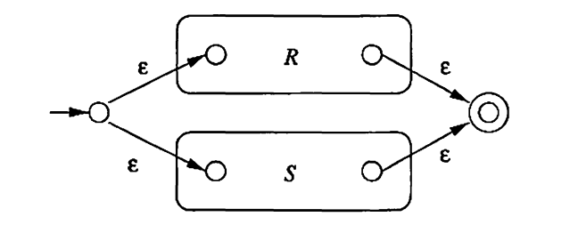
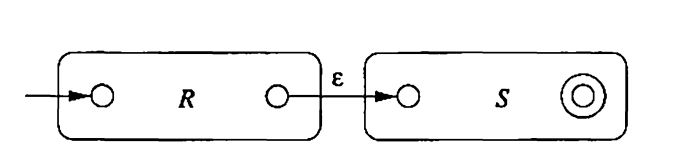
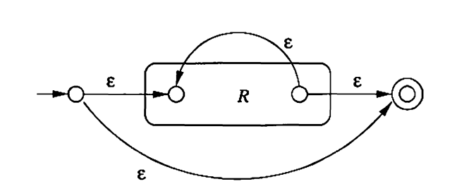
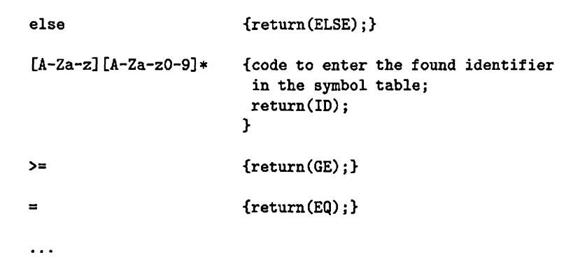

- In this chapter, we introduce the notation called **regular expressions**.
- Just the same as automata, regular expressions are another type of language-defining notation.
- We will show the equivalence between regular expressions and finite automata, and thus the regular language.
- We will finally discuss the algebraic laws for regular expressions.

---
## 3.1 Regular Expressions 

**Three Operators in Regular Expressions**

Regular expressions consists of symbols and operators. The operators actually denote operations on languages, including three kinds:

- **Union**: The union of two languages $L$ and $M$.
- **Concatenation**: The concatenation of two languages $L$ and $M$ is the set of strings that can be formed by taking any string in $L$ and concatenating it with any string in $M$.
- **Closure**: The closure (or Kleene closure) of a language $L$ is denoted $L^*$ and represents the set of strings that can be formed by taking any number (could be zero) of strings from $L$, possibly with repetitions, and concatenating all of them.

---
**Definition 3.1**: The regular expressions and the corresponding languages they represent are defined recursively as follows:

**Basis**: The basis consists of two parts:

1. The constant $\epsilon$ and $\emptyset$ are regular expressions, with $L(\epsilon) = \lbrace \epsilon \rbrace$ and $L(\emptyset) = \emptyset$.
2. If $a$ is any symbol, then $\mathbf{a}$ is a regular expressions, with $L(\mathbf{a}) = \lbrace a \rbrace$.

**Induction**: There are four types of inductive steps, three for the three operators and one for parenthesis.

1. (Union) If $E, F$ are regular expressions, then $E+F$  is a regular expression, with $L(E+F) = L(E) \,\cup\, L(F)$.
2. (Concatenation) If $E, F$ are regular expressions, then $EF$ is a regular expression, with $L(EF)=L(E)L(F)$.
3. (Closure) If $E$ is a regular expression, then $E^*$ is a regular expression, with $L(E^*) = (L(E))^*$.
4. If $E$ is a regular expression, then $(E)$ is a regular expression, with $L((E)) = L(E)$.

---
**Precedence of Regular Expression Operators**

Just like algebras, R.E. operators have an assumed order of precedence, and parenthesis can be used to change the order.

1. The closure (or star) operator is of the highest precedence.
2. The concatenation operator is of the second highest precedence.
3. The union operator is of the third highest precedence.

---
## 3.2 Finite Automata and Regular Expressions

While R.E. approach to describing languages is fundamentally different from the automaton approach, these two notations turn out to have exactly the same power.

Therefore, the ability of finite automata can be thought of three types of functions: taking the union, concatenating, and making repetition.

To formally show this, the work we will do contains:

1. Show a DFA can be transformed into a equivalent R.E.
2. Show a R.E. can be transformed into a equivalent $\epsilon$-NFA.

> In Chapter 2, we already show the equivalence between DFA and NFA; and equivalence between DFA and $\epsilon$-NFA, based on subset construction. We use them alternatively here as any one can be transformed into another. In fact, the meaning of introducing $\epsilon$-transitions is just make it easier for things like R.E. transformation.

---

**Theorem 3.1**: If $L=L(A)$ for some DFA $A$, then there is a regular expression $R$ such that $L=L(R)$.

**Proof**: Suppose the states of $A$ are $\lbrace 1, 2, \cdots, n \rbrace$ for some integer $n$. The names of states are not important. We will construct a collection of R.E.'s in form of $R_{ij}^{(k)}$, to denote the language whose strings $w$ is the label of a path from state $i$ to state $j$, and with no intermediate node whose number os greater then $k$. 

We start from $k=0$ and finally reach $k = n$, where there is no restriction at all, and union of R.E.'s that start from start state and end up in accepting states will be equivalent with the DFA. 

We finish the construction of all R.E. by induction on $k$.

**Basis**: Since $k=0$, all paths must have no intermediate states. Only a single step of transition or self-loop is valid. Given $i, j$, consider this set of input symbols

$$
\lbrace a\mid  a \in \Sigma \, \cup \epsilon, \  \delta(i, a) = j \rbrace = \lbrace a_1, a_2, \cdots, a_m \rbrace
$$
Here, we define for DFA's that $\delta(i, \epsilon) = i$. Then the R.E. will be 

$$
R_{ij}^{(0)} = \sum_{i=1}^m \mathbf{a_i}
$$
 If $m = 0$, then $R_{ij}^{(0)} = \emptyset$.

**Induction**: Assume we have all $R_{ij}^{(k-1)}$ for any $i, j$.  Suppose there is a path from state $i$ to $j$ that goes through no states higher than $k$. There are two possible cases:

1. The path does not pass $k$ at all. In this case, we have
	$$
	R_{ij}^{(k)} = R_{ij}^{(k-1)} 
	$$
2. The path goes through $k$ at least once (and as many times as it wants). Then, the path can be divided into three parts:
	- From starting at $i$ , to arriving at $k$ for the first time.
	- From arriving $k$ for the first time, to arriving $k$ for the last time.
	- From arriving $k$ for the last time, to finally arriving $j$.

In this case, we have

$$
R_{ij}^{(k)} = R_{ik}^{(k-1)} (R_{kk}^{k-1})^*R_{kj}^{(k-1)}
$$
To sum up, we take the union of the two possible cases and have:

$$
R_{ij}^{(k)} = R_{ij}^{(k-1)} + R_{ik}^{(k-1)} (R_{kk}^{k-1})^*R_{kj}^{(k-1)}
$$
Eventually, we have all $R_{ij}^{(n)}$ for any $i, j$. Suppose the start state to be $q_0$ and the accepting states tp be $F$. The equivalent regular expression is

$$
\sum_{j \in F}R_{q_0j}^{(n)}
$$

> Note the $\epsilon$ is necessary when constructing $R_{ii}^{(0)}$'s. Consider a DFA with only one state, which is both start and accepting state, and no transition, or transitions to a dead state. This DFA accepts only $\epsilon$, rather than accepting empty set $\emptyset$.

---
**Theorem 3.2**: If $L=L(T)$ for some regular expression $T$, then there is a $\epsilon$-NFA $E$ such that $L=L(E)$.

**Proof**: The proof is by structural induction on $R$, following the recursive definition of regular expressions.

**Basis**: There are two parts to the basis.
1. For $\epsilon$ , we construct a $\epsilon$-NFA that has a single transition from its start state to accepting state labeled $\epsilon$. For $\emptyset$, we construct a $\epsilon$-NFA that has no transition, and the start state is not accepting.
2. For a symbol $a$, we construct a $\epsilon$-NFA that has a single transition form its state to accepting state labeled $a$.

**Induction**: There are four parts of the induction. We assume that the statement of the theorem is true for the immediate subexpressions of a given regular expression.
1. $T = R+S$ for some smaller expression $R, S$. Then the automaton of Figure 3.1 serves.
	
2.  $T = RS$ for some smaller expression $R, S$. Then the automaton of Figure 3.2 serves.
	
3. $T=R^*$ for some smaller expression $R$. Then the automaton of Figure 3.3 serves.
	
4. The expression is $(R)$ for some smaller expression $R$. Then the automaton for $R$ also serves as the automaton for $(R)$.
---
## 3.3 Applications of Regular Expressions

**Regular Expressions in UNIX**

- UNIX notation for regular expressions introduces a number of additional capabilities.
- In fact, UNIX extensions include some features to  name and refer to previous strings that matched a pattern, which actually allows non-regular languages to be recognized, but we shall not consider these features here.
---
The first enhancement is character classes.
- The symbol $.$ (dot) stands for "any character", in the ASCII character set.
- The sequence $[a_1a_2 \cdots a_k]$ stands for $a_1 + a_2 \cdots +a_k$.
- The sequence $[x-y]$ means all the characters from $x$ to $y$ in the ASCII sequence. For example $[\texttt{A-Za-z0-9}]$ expressed the set of all letters and digits.
- There special notations for several common classes.
	- $\texttt{[:digit:]}$ is the same as $\texttt{[0-9]}$.
	- $\texttt{[:alpha:]}$ is the same as $\texttt{[A-Za-z]}$.
	- $\texttt{[:alnum:]}$ is the same as $\texttt{[A-Za-z0-9]}$.
---
There are additional operators in UNIX notation, but none of them extended what languages can be expressed.
- The operator $\mid$ is used in place of $+$ to denote union.
- The operator $?$ means "zero of one of". Thus $R?$ is the same as $\epsilon \mid R$.
- The operator $+$ means "one or more of". Thus $R+$ is the same as $RR^*$.
- The operator $\lbrace n \rbrace$ means "$n$ copies of". Thus $R\lbrace 5\rbrace$ is the same as $RRRRR$.
---
- The UNIX notation all parenthesis to group subexpressions, just as for the Definition 3.1.
- The precedence of $?$, $+$ and $\lbrace n \rbrace$ is the same as closure $*$.

---
**Lexical Analysis**

One of the oldest applications of regular expressions was in specifying the components of a compiler called lexical analyzer. It takes as input a list of regular expressions, in UNIX style, each followed by a bracketed section of code that indicates what it is to do when it finds an instance of that token, i.e. a matched pattern described by regular expressions.

Figure 3.4 shows an example of partial input to the $\texttt{lex}$ command or its GNU version $\texttt{flex}$, describing some of the tokens in $\texttt{C}$ language. Each entry defines a token and the action when a match is found.

The $\texttt{lex}$ or $\texttt{flex}$ use the regular-expression-to-DFA conversion process to generate an efficient function to break source programs into tokens. 

We start by building an automaton for the union of all the expressions. This automaton in principle tells us only that **some** token has been recognized。 However, if we follow the construction of Theorem 3.2 for the union expressions, the $\epsilon$-NFA state tells us exactly which token has been recognized.

The only problem is that more than one token may be recognized at once. For instance, the string $\texttt{else}$ matches not only regular expression $\texttt{else}$ but also the expression for identifiers. The standard resolution is to give priority to the expression list. If we want keywords like $\texttt{else}$ to be reserved, we simply give them higher priorities.

---
## 3.4 Algebraic Laws for Regular Expressions

- In the DFA-to-Regular-Expression conversion, we may have lots of $\epsilon$ and $\emptyset$ in $R_{ij}^{(0)}$'s, which would exist all the time in subsequent computation.
- However, they can be simplified, such as
	$$
	\begin{aligned}
		(\epsilon + R)^* = R^* \\
		\emptyset R = R \emptyset = \emptyset \\
		\emptyset + R = R + \emptyset = R
	\end{aligned}
	$$
- Two regular expressions are equivalent if they represent the same language.
- Two regular expressions with variables are equivalent if they represent the same language whatever languages we substitute for the variables.
- We shall systematically study the algebraic laws for R.E.'s.
---
**Associativity and Commutativity**
Let $L, M, N$ be regular expressions, then:
- $L + M = M + L$ (Commutative law for union)
- $(L+M)+N=L+(M+N)$ (Associative law for union)
---
**Identities and Annihilators**
Let $L$ be a regular expression, then
- $\emptyset + L = L + \emptyset = L$. (Identity for union)
- $\epsilon L= L\epsilon = L$. (Identity for concatenation)
- $\emptyset L = L \emptyset = \emptyset$ (Annihilator for concatenation)
---
**Distributive Laws**
Let $L, M, N$ be regular expressions, then
- $L(M+N) = LM + LN$. (Left distributive law of concatenation over union)
- $(M+N)L = ML + NL$. (Right distributive law of concatenation over union)
---
**Idempotent Law**
Let $L$ be a regular expression. then
- $L + L = L$. (Idempotence law for union)
---
**Laws Involving Closures**
- $(L^*)^* = L^*$.
- $\emptyset^* = \epsilon$.
- $\epsilon^* = \epsilon$.
- $L^+ = LL^* = L^*L$.
- $L^* = L^+ + \epsilon$.
- $L? = \epsilon + L$.
---
**Discovering Laws for Regular Expressions**

- There are infinitely many laws beyond those shown above.
- To test whether a "proposed laws" holds, we can use a substitution process.
- Since the laws should hold for any expression, or language, we can think of the variables as concrete regular expression, which has no variables.
- Then we test if the formed expressions represents the same language. If so, we will show it is sufficient to prove the original law is true.
---
**Theorem 3.3**: Let $E$ be a regular expression of variables $L_1, L_2, \cdots, L_m$. Form concrete regular expression $C$ by replacing each occurrence of $L_i$ by the symbol $a_i$. Then for any $L_1, L_2, \cdots, L_m$, if a string $w\in L(E)$, it can be written as $w = w_1w_2\cdots w_k$ where each $w_i \in L_{j_i}$, and the corresponding string $w'=a_{j_1}a_{j_2}\cdots a_{j_k} \in L(C)$.

**Proof**: The proof is a structural induction on the expression $E$.

**Basis**: The basis cases are where $E$ is $\epsilon$, $\emptyset$, or a single variable $L$. For the first two cases, there is no substitution at all. If $E = L$, substitute $L$ by $a$, we have $L(E)=L$ and $L(C) = \lbrace a \rbrace$. The theorem says if $w\in L$, then $a \in \lbrace a \rbrace$, which is true.

Induction: There are three cases.
- $E = F + G$. Let $C, D$ be the concrete expressions formed from $F, G$ respectively, and the concrete expression for $E$ is $C+D$. Assume the statement is true for $F$ and $G$.  If a string $w\in L(E)$, then $w\in L(F)$ or $w \in L(G)$. Assume that $w\in L(E)$, with the argument of the counterpart be the same. In this case, we know by induction hypothesis that the corresponding string $w'\in L(C)$, and thus $w'\in L(C+D)$.
- $E = FG$. Let $C, D$ be the concrete expressions formed from $F, G$ respectively, and the concrete expression for $E$ is $CD$. Assume the statement is true for $F$ and $G$. If a string $w\in L(E)$, then we have $w = w_1w_2$ and $w_1\in L(F), w_2 \in L(G)$. By induction hypothesis we know that $w_1' \in L(C)$ and $w_2'\in L(D)$, and so $w=w_1'w_2' \in L(CD)$.
- $E = F^*$. Let $C$ be the concrete expression formed from $F$, and the concrete expression for $E$ is $C^*$. Assume the statement is true for $F$. If a string $w\in L(E)$, then we have $w = w_1^k$, where $k\geq 0$ and $w_1 \in L(F)$. By induction hypothesis we know that $w_1' \in L(C)$, and so $w=(w'_1)^k \in L(C^*)$.
---
**Theorem 3.4**: Let $E, F$ be regular expressions of variables, and $C, D$ are concrete regular expressions converted from $E, F$ by replacing each variable by a concrete symbol, respectively. Then, $L(E) = L(F)$ for any languages in place of the variables of $E, F$ , i.e. $E=F$, if and only $L(C)=L(D)$.

**Proof**: (Only-if) Suppose $E=F$. Since $L(E)=L(F)$ holds for any choice of language, then we choose for every variable the concrete symbol that replaces that variable in expressions $C$ and $D$. By this choice,  we have $L(E)=L(C)$ and $L(F)=L(D)$, and thus $L(C)=L(D)$.

(If) Suppose $L(C) = L(D)$. Given any choice of languages $L_1, L_2,\cdots, L_k$ for the variables in $E$ , we know that if $w\in L(E)$, we have $w = w_1w_2\cdots w_k$, and the corresponding $w' = a_{j_1}a_{j_2}\cdots a_{j_k} \in L(C)$.  By Theorem 3.3, we have if $w\in L(E)$, then $w'\in L(C)$. Similarly, if $w\in L(F)$, then $w' \in L(D)$. 

The point is, we can think of $C$ as regular expressions of "variables" $a_1, a_2, \cdots, a_k$, and the substitution process can be reversed, i.e., $w_1, w_2, \cdots, w_k$ are "concrete symbols" that replace $a_1, a_2, \cdots, a_k$. The reversed substitution gives exactly $L(E)$. By Theorem 3.3 we know if $w' \in L(C)$, then $w \in L(E)$. Using the same argument, we have $w' \in L(D)$ , then $w\in L(F)$.  

Then we can show $L(E)=L(F)$. If $w\in E$, then we have $w '\in L(C) = L(D)$, and then $w \in L(F)$. By symmetry, if $w\in L(F)$, we will have $w \in L(E)$. Therefore, we conclude that $L(E) = L(F)$.

> To see Theorem 3.3 and 3.4 are non-trivial, consider what if the regular expression algebra includes the intersection operator $\cap$. 
> 
> Our proposed law would be $L \cap M \cap N = L \cap N$, which is obviously false. And if we choose  $a, b, c$  to replace $L, M, N$ respectively,  we do have $\lbrace a \rbrace \cap \lbrace b \rbrace \cap \lbrace c \rbrace = \lbrace a \rbrace \cap \lbrace b \rbrace$. 
> 
> In this case, we do not have conclusions like Theorem 3.3. If we are to use the same structural induction approach, consider $E = F \cap G$, and the concrete expression $C, D$ for $F, G$ respectively. We cannot construct strings in $L(C) \cap L(D)$ from strings in $L(E)$.

---
Reference:  Introduction to Automata Theory, Languages, and Computation. John E. Hopcroft, Rajeev Motwani, Jeffrey D. Ullman.